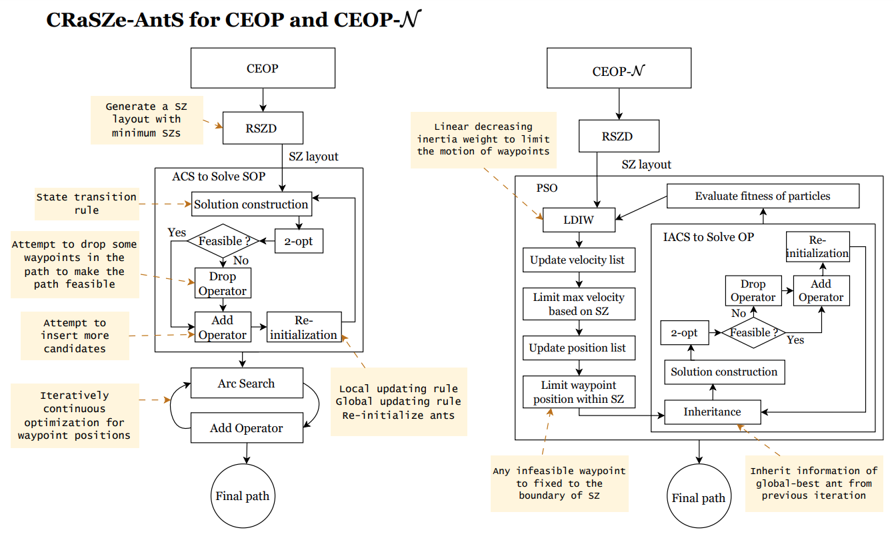

# CRaSZe-AntS
CRaSZe-AntS is a hybrid algorithm for <ins>**C**</ins>lose Enough Orienteering Problem (CEOP) that combines the advantages of the <ins>**Ra**</ins>ndomized <ins>**S**</ins>teiner <ins>**Z**</ins>on<ins>**e**</ins> Discretization scheme and the <ins>**Ant**</ins> Colony <ins>**S**</ins>ystem (ACS). To solve CEOP with different cost functions to collect prizes, CRaSZe-AntS involves different operators. This repository explains how CRaSZe-AntS works in CEOP and CEOP- $\mathcal{N}$ and experimental results achieved by CRaSZe-AntS and benchmark algorithms. CRaSZe-AntS can solve three problems:
1. SOP: The [Set Orienteering Problem](https://www.sciencedirect.com/science/article/pii/S0377221717310202). Here, our SOP allows at most **one** visit to the vertex in each group.
2. CEOP: The [Close Enough Orienteering Problem](https://ieeexplore.ieee.org/document/7844421).
3. TDDP: The Truck-and-Drone Delivery Problem. Please check our paper for the formal formulation.

Please see more details in our [paper](https://www.sciencedirect.com/science/article/pii/S0377221724003916?via%3Dihub). Citation:
```
@article{QIAN2024,
title = {On solving close enough orienteering problems with overlapped neighborhoods},
journal = {European Journal of Operational Research},
year = {2024},
issn = {0377-2217},
doi = {https://doi.org/10.1016/j.ejor.2024.05.032},
url = {https://www.sciencedirect.com/science/article/pii/S0377221724003916},
author = {Qiuchen Qian and Yanran Wang and David Boyle}}
```

## Overall design of CRaSZe-AntS


## Quick Start

### Prerequisites
The source code is written in ISO C++20. The binary code has been tested on Red Hat Enterprise Linux (version 8.5). The dependencies are listed as follows:
* g++ (GCC) 8.5.0 20210514 (Red Hat 8.5.0-4)
* [nlohmann/json](https://github.com/nlohmann/json)
* Python 3.11.3 (for scripts)

### Build
Because we use `fstream` library for data I/O, to compile, please use the following command:
```bash
g++ -std=c++2a -o crazyants <path-to-all-src>*.cpp -lstdc++fs
```

### Instructions
1. Create a directory structure as follows:
```
workspace/
├── crazyants (binary file)
├── configs/
│   ├── bubbles.tddp.json
├── data/
│   ├── tddp/
│   │   ├── bubbles1.tddp
│   │   ├── ...
│   │   ├── sz-vtxs/
│   │   │   ├── bubbles1.szppt
│   │   │   ├── ...
│   │   ├── sols/
│   │   │   ├── bubbles1.tddp_sol
│   │   │   ├── ...
├── scripts/
│   ├── myscript.sh
│   ├── applyBudgetRatioCEOP.py
├── src/
│   ├── tddp/
│   │   ├── PSO.h
│   │   ├── PSO.cpp
│   │   ├── ...
```
2. Run CRaSZe-AntS with **script**, check [example script](scripts/example_script.sh) for more details:
```bash
cd scripts
./example_script.sh
```
3. Check results in `workspace/data/tddp/sols/`.

## Evolution process visualization
Below, we show the full evolution process of two algorithms in solving TDDP instance _bubbles1_:

### CRaSZe-AntS


### BE-PSO-IACS


